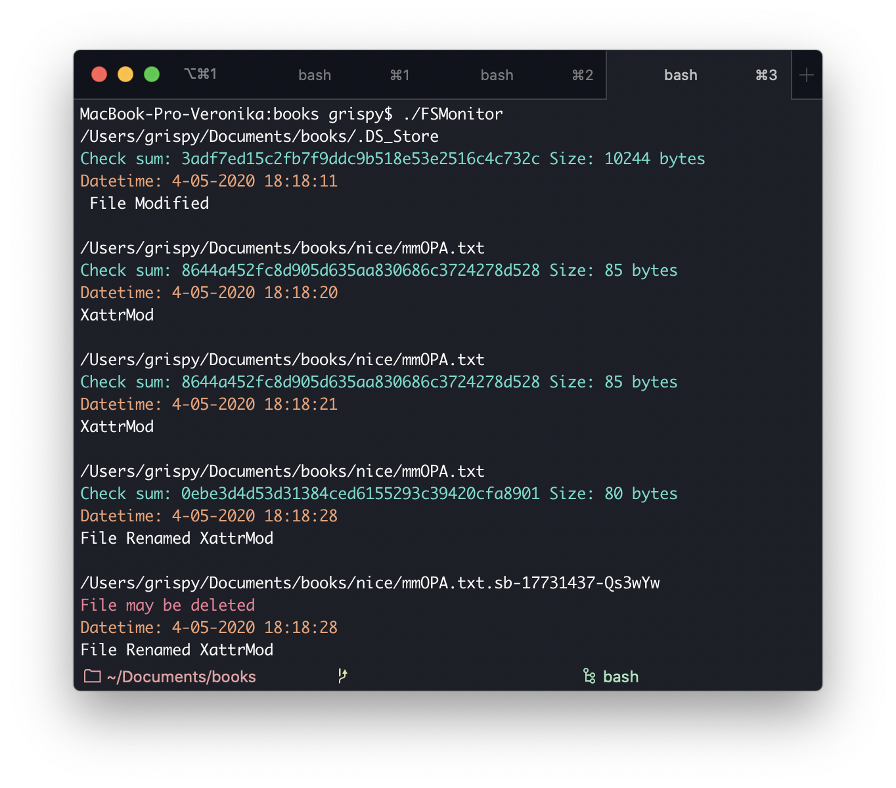

# File System Monitor
Simple utility for macOS to watch files changes within a directory.
Get info about modification details, time, size and checksum of the file.

## Getting started
### Prerequisites
MacOS 10.7 or higher.

### Installing
Compile main.c file
```
clang main.c -framework CoreServices -o FSMonitor
```
and run it (if no arguments current directory by default)
```
./FSMonitor [path/to/directory]
```


